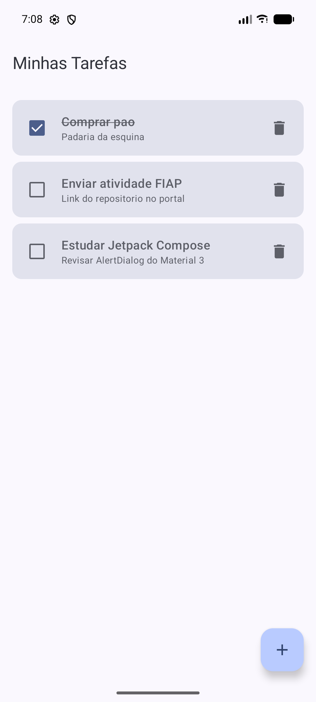
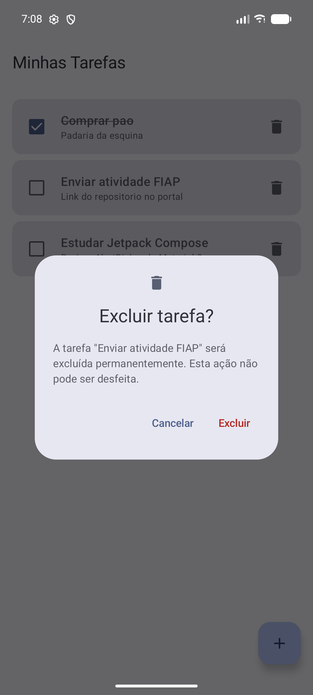
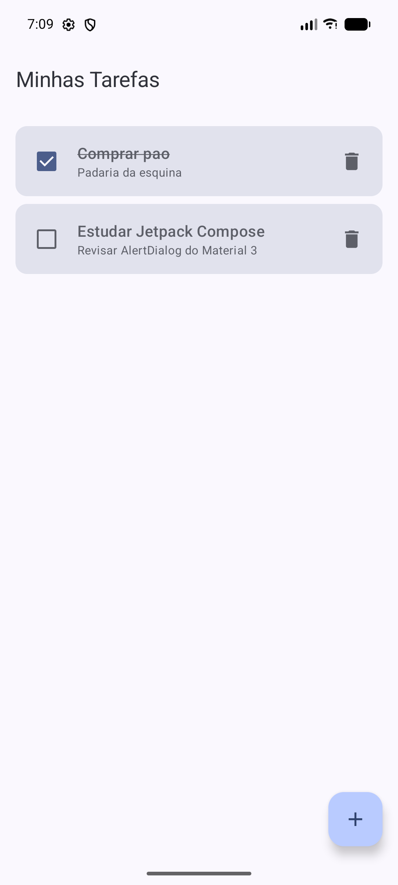

# Evidências — Confirmação de exclusão de tarefa

Ao tocar no ícone de lixeira, a tarefa não é mais excluída imediatamente. Um `AlertDialog` do Material 3 é exibido sobre a tela da lista, com o título da tarefa selecionada e as ações **Cancelar** e **Excluir**.

Implementação:

- `TarefaViewModel` guarda a tarefa pendente em `tarefaParaExcluir: StateFlow<Tarefa?>` e expõe `solicitarExclusao`, `cancelarExclusao` e `confirmarExclusao`. Só a tarefa guardada nesse estado é excluída.
- `ListaTarefasScreen` observa esse estado e exibe o `ConfirmarExclusaoDialog` quando ele não é nulo.
- Previews novas: **"Confirmação de exclusão"** (lista com o diálogo aberto) e **"Diálogo de exclusão"**.

Capturas feitas no emulador (Pixel 8). A tarefa usada no teste é **"Enviar atividade FIAP"**, a do meio da lista.

## 1. Lista antes da exclusão

Três tarefas cadastradas; "Comprar pao" está concluída.

## 2. Diálogo aberto com a tarefa selecionada

Ao tocar na lixeira de "Enviar atividade FIAP", o diálogo mostra o título dessa tarefa.

## 3. Resultado ao cancelar

Ao tocar em **Cancelar**, o diálogo fecha e a lista continua igual.

## 4. Nova abertura do diálogo

O diálogo é aberto de novo para a mesma tarefa.

## 5. Resultado após confirmar a exclusão

Ao tocar em **Excluir**, apenas "Enviar atividade FIAP" é removida. As outras tarefas continuam na lista, e a conclusão de "Comprar pao" se mantém.

